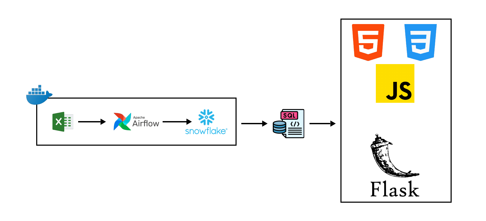

# 🚗⚡ Electric Vehicle Market Analysis in Morocco

[](https://opensource.org/licenses/MIT)
[](https://airflow.apache.org/)
[](https://www.snowflake.com/)
[](https://flask.palletsprojects.com/)

## 📊 Project Overview

A modern and automated platform for analyzing the electric vehicle market in Morocco, combining robust data infrastructure with an interactive dashboard. This solution enables tracking EV market evolution, identifying trends, and making strategic decisions based on up-to-date data.



## 🌟 Key Features

- **Automated Collection**: Aggregation of data from multiple sources in a standardized format
- **Orchestrated ETL**: Scalable data pipeline managed by Airflow in a containerized environment
- **Optimized Cloud Storage**: Utilizing Snowflake for superior performance and availability
- **Interactive Visualization**: Intuitive web dashboard presenting key insights on the market

## 🏗️ Technical Architecture

### 1. Data Collection and Ingestion
```
Data Sources (CSV/XLSX) → Airflow DAGs → Snowflake Data Warehouse
```

### 2. Processing and Analysis
```
Snowflake → SQL Transformations → Analytical Models
```

### 3. Visualization and Presentation
```
Snowflake → Flask API → HTML/CSS/JS Frontend → User Dashboard
```

## 🚀 Installation and Deployment

### Prerequisites
- Docker and Docker Compose
- Snowflake Account (or access to an instance)
- Python 3.8+

### Quick Setup

1. **Clone the repository**
   ```bash
   git clone https://github.com/your-username/morocco-ev-analysis.git
   cd morocco-ev-analysis
   ```

2. **Environment setup**
   ```bash
   cp .env.example .env
   # Edit environment variables in .env
   ```

3. **Start services**
   ```bash
   docker-compose up -d
   ```

4. **Access interfaces**
   - Airflow UI: `http://localhost:8080`
   - EV Dashboard: `http://localhost:5000`

## 💻 Usage

### Electric Vehicle Dashboard

The web dashboard offers several analytical views:

- **Market Overview**: Sales trends and registrations
- **Model Analysis**: Comparison of vehicles available in Morocco
- **Charging Infrastructure**: Mapping of charging stations
- **Future Projections**: Estimates based on historical data

### Airflow Workflow Management

Available Airflow DAGs:

- `import_raw_data_dag`: Import source files
- `transform_ev_data_dag`: Data normalization and transformation
- `analytics_generation_dag`: Calculation of analytical metrics

## 🛠️ Technology Stack

| Component | Technology | Role |
|-----------|-------------|------|
| Orchestration | Apache Airflow | Data flow automation |
| Storage | Snowflake | Scalable data warehousing |
| Backend | Flask (Python) | API and business logic |
| Frontend | HTML/CSS/JavaScript | User interface |
| Containerization | Docker | Development/deployment environment |
| Source Data | Excel/CSV | Initial data formats |

## 📈 Roadmap

- [ ] Integration of real-time data source APIs
- [ ] Geographic coverage extension to North Africa

## 👥 Contributors

- [Ayoub Anhal](https://github.com/ayoub-anhal) - Big Data & AI Engineer

## 📄 License

This project is licensed under the MIT License - see the [LICENSE](LICENSE) file for details.

## 📞 Contact

For questions or collaborations, don't hesitate to reach out:

- Email: ayoubanhal01@gmail.com
- LinkedIn: [Your Profile](www.linkedin.com/in/ayoub-anhal)
